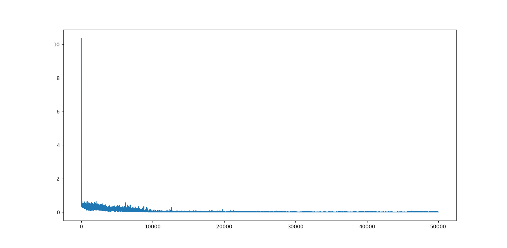

# 一、概述
基于Python.Numpy实现循环神经网络，预测正弦信号与短句

# 二、文件夹结构功能
### 1.文件夹
- parameters：神经网络训练结果保存路径
- figure：该文档中的图片
### 2.文件
- activate.py：激活函数层，包含Sigmoid，SoftMax
- bp.py：BP神经网络层，全连接层
- module.py：网络层、结构接口定义
- rnn.py：循环层
- RNN_sentence.py：循环神经网络短句预测测试文件
- RNN_sin.py：循环神经网络正弦信号预测测试文件

# 三、项目运行
## 1.循环神经网络短句预测
### 1.1测试目标
- 使用循环神经网络预测“欢迎光临!”，在输入短句中的一个词后预测整个短句
### 1.2测试方式
- 运行RNN_sentence.py文件
### 1.3测试结果
- 1.训练完成后输出如下
```bash
欢迎光临!
欢迎光临!
欢迎光临!
欢迎光临!
```
- 2.训练误差如下图所示，可以看到，训练过程中误差在不断缩小


## 2.循环神经网络正弦信号预测
### 2.1测试目标
- 使用循环神经网络预测正弦信号。在输入起始值后，可以预测出完整的正弦信号
### 2.2测试方式
- 运行RNN_sin.py文件
### 2.3测试结果
- 1.训练完成后输出如下
```bash
开始训练: 2023-03-11 08:20:13.561935
训练已完成练100%,误差:0.000276
结束训练: 2023-03-11 08:23:09.970223
```
- 2.训练后测试正确率如下图所示，可以看到，随着训练次数增加，误差在不断缩小



- 3.预测结果如下图所示，可以看到输入分别为0.0,0.2,0.4,0.6,0.8,1.0时预测的正弦信号基本正确


